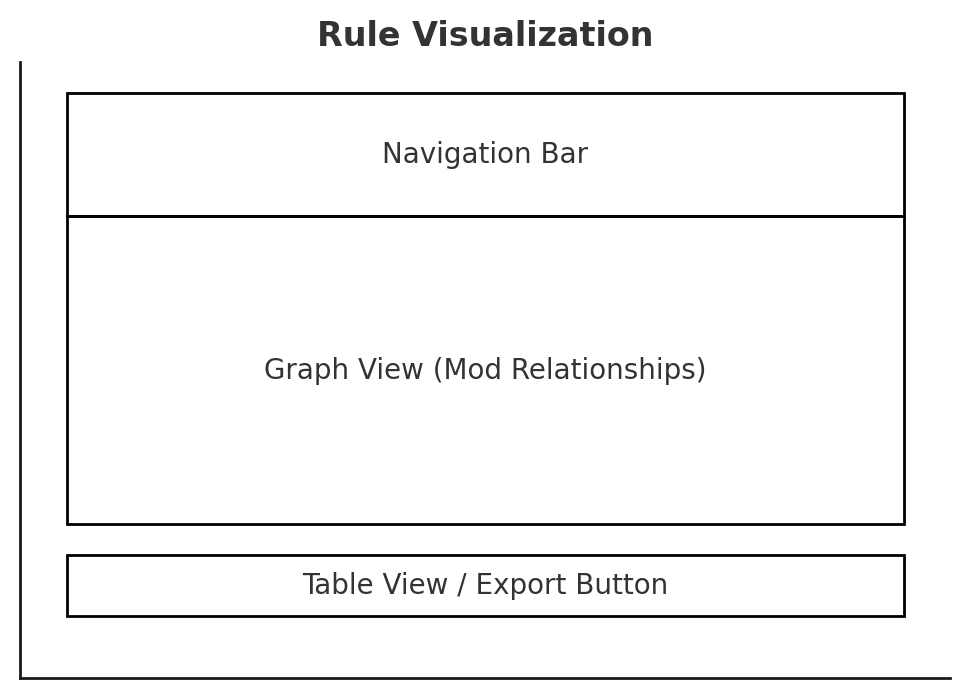
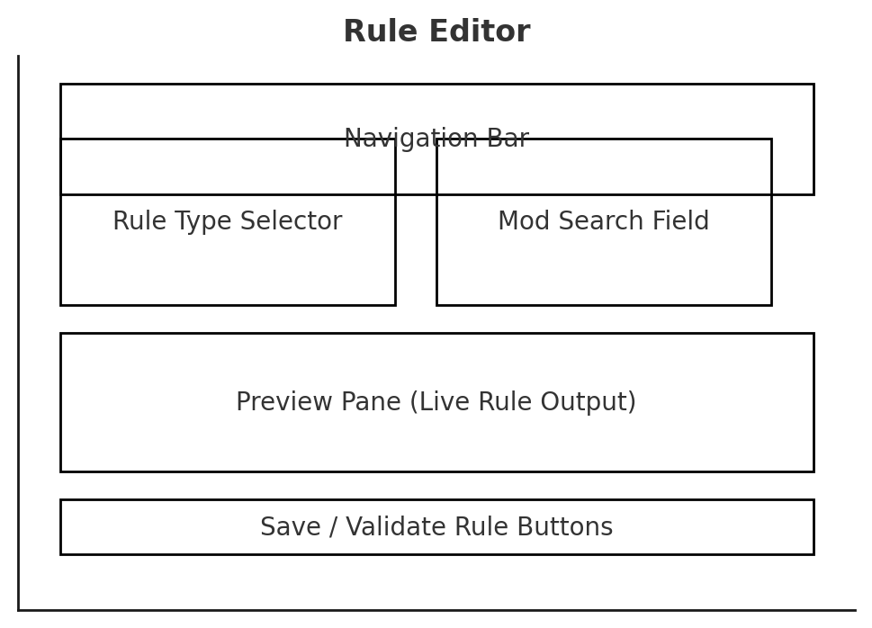

[Table of contents](index.md)

## **🛠️ Core Workflows**
These workflows represent **key user actions** from start to finish.

### **1️⃣ Creating a New Rule**
**Goal:** Help a modder define a new mlox rule easily.  

#### **Steps:**  
1. **User selects "Create Rule"** from the main menu.  
2. **Choose rule type** (`[Order]`, `[Conflict]`, `[Requires]`, etc.).  
3. **Search for or select mods** involved in the rule:  
   - Manually enter mod names.  
   - Select from **installed mod list** (if available).  
   - Use **Nexus API search** to auto-fill mod details.  
4. **Define rule details** (e.g., conflict severity, required dependencies).  
5. **Preview rule** (formatted in mlox DSL).  
6. **Save rule** to local database (`mlox_user.txt` exportable).  

---

### **2️⃣ Editing an Existing Rule**
**Goal:** Modify an existing mlox rule for clarity or updates.  

#### **Steps:**  
1. **User selects "Edit Rule"** from the main menu.  
2. **Browse rules** (from local storage or GitHub sync).  
3. **Modify rule details** in structured input fields or raw text editor.  
4. **Preview & validate rule formatting**.  
5. **Save changes** and update local ruleset.  

---

### **3️⃣ Detecting Mod Dependencies & Conflicts**
**Goal:** Help modders find dependencies & conflicts for a mod.  

#### **Steps:**  
1. **User selects "Analyze Mod"** and searches for a mod:  
   - Search by **installed mods**.  
   - Use **Nexus API lookup** (by name, ID, or MD5).  
2. **Tool retrieves dependency & conflict data** from Nexus and existing rules.  
3. **Display results** in an easy-to-read format:  
   - **Dependencies** (what this mod requires).  
   - **Conflicts** (known issues with other mods).  
   - **Existing rules** (if already documented in mlox).  
4. **User chooses to create/edit rules** based on findings.  

---

### **4️⃣ Visualizing Load Order & Rule Effects**
**Goal:** Provide an intuitive way to understand rule relationships.  

#### **Steps:**  
1. **User selects "Visualize Rules"** from the main menu.  
2. **Choose a visualization type:**  
   - **Graph View** (dependency/conflict network).  
   - **Table View** (structured rule list).  
3. **Interact with visualization**:  
   - Click a mod to see **rules affecting it**.  
   - Drag-and-drop mods to **adjust order** (and auto-suggest rules).  
4. **Apply changes or export rule adjustments**.  

---

### **5️⃣ Exporting & Sharing Rules**
**Goal:** Allow users to **save, share, and apply their rules** effectively.  

#### **Steps:**  
1. **User selects "Export Rules"**.  
2. **Choose export format** (`mlox_user.txt`, JSON, or shareable URL).  
3. **Save to disk** or **copy for external sharing**.  
4. (Future: If web-based, allow syncing with a community rule hub).  

---

## **Optional Workflows for Later Expansion**
💡 **Not immediate priorities, but ideas for future versions.**  

- **🌀 Sync with mlox GitHub** – Pull existing rules & auto-update local copy.  
- **🔍 Advanced Rule Debugging** – Simulate mod load order effects based on rules.  
- **🌐 Online Rule Collaboration** – Let modders share & refine rules together.  

---

[Table of contents](index.md)
